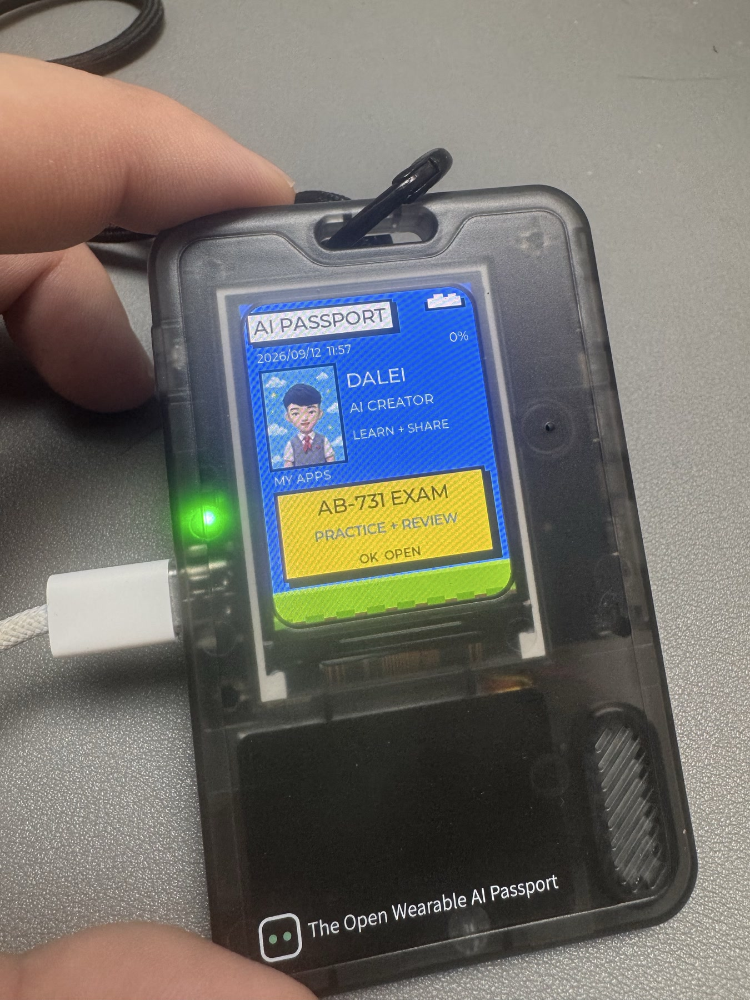
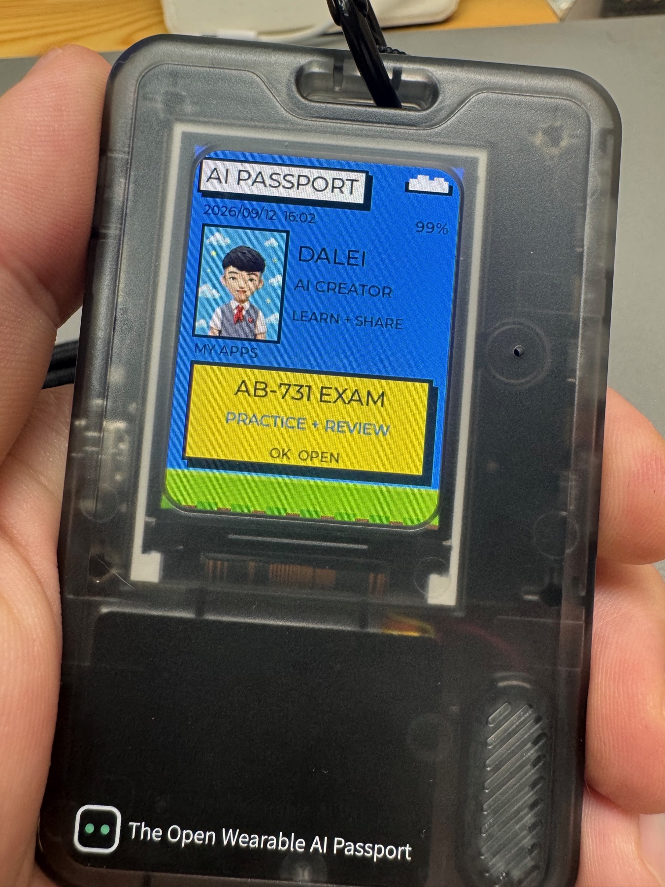
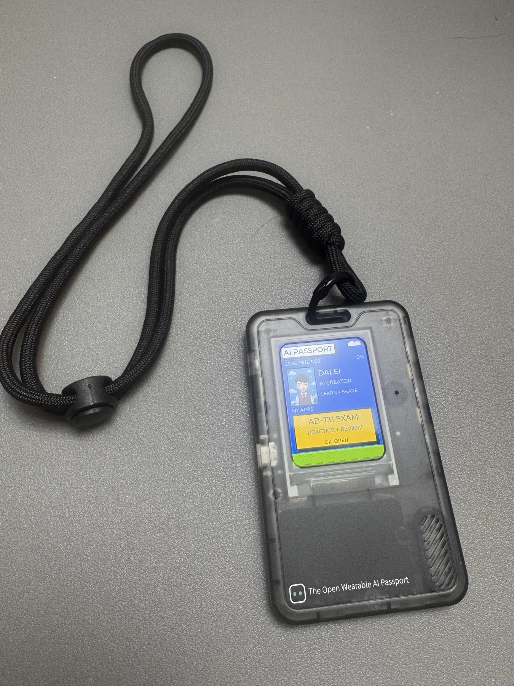

<p align="right">
  <a href="README.zh_CN.md">Simplified Chinese</a> · <strong>English</strong>
</p>

# AI Passport 2026

<p align="center">
  
</p>

My third open-source project: a personal home screen and expandable app launcher
for the FoloToy AI Passport. It shows a full portrait, creator identity, date,
time, and battery status, while keeping independently selectable apps below.

The first bundled app is an offline AB-731 pocket-practice experience. It
contains 100 original study questions aligned with the Microsoft Learn skills
measured from July 22, 2026. They are learning material, not live exam items.

## Highlights

- Personal Passport home with a full 3:4 portrait and creator introduction.
- Live local date and time plus battery status.
- AB-731 remains an optional sub-app instead of taking over the startup screen.
- All four choices remain visible while `UP` and `DOWN` move one highlight.
- Immediate explanations, mistake review, accuracy tracking, and saved progress.
- Fully offline use with three physical buttons and no account required.

## Real-device gallery

<table>
  <tr>
    <td width="50%" align="center">
      <br>
      <sub>Personal Passport home and AB-731 app entry</sub>
    </td>
    <td width="50%" align="center">
      <br>
      <sub>The complete wearable device in use</sub>
    </td>
  </tr>
</table>

## Controls

- Passport home: one profile avatar and the app menu appear first. AB-731 starts
  highlighted; press `OK` once to open it.
- AB-731 home: press `UP` or `DOWN` to switch between all questions and saved mistakes;
  press `OK` to start.
- Question: all four answers stay visible; press `UP` or `DOWN` to move the
  highlight, then press `OK` to submit.
- Feedback: press `OK` for the next question.
- Inside AB-731: hold `OK` to return to the Passport profile home.
- Inside AB-731: hold `UP` to clear saved answers and restart from the app home.

Accuracy, mistakes, and the latest question are saved in the device NVS. Flash
writes run in a worker task so button handling remains responsive.

The offline clock starts from the firmware build time and advances while the
device is running. It does not currently perform network time synchronization.

## Build

Activate ESP-IDF v5.5.3, then run:

```bash
./tools/validate.sh
```

The verified installable image is written to
`build/FoloToy-AI-Passport-full.bin`. Hardware flashing and button/display
acceptance still require a connected AI Passport.

## Install

Download `FoloToy-AI-Passport-full.bin` from the latest GitHub Release, or build
it locally with the command above. Keep the protected device identity partition
intact when flashing a provisioned Passport; see the repository's protected
Flash-layout guide before using low-level flashing tools.

## Open-source origin

This project is built on [FoloToy AI Passport](https://github.com/folotoy/ai-passport)
and preserves its MIT license and upstream history. The personal home, portrait
presentation, app launcher, AB-731 learning experience, question set, progress
flow, and associated tests are maintained by Lei Pan (`paul010`).
