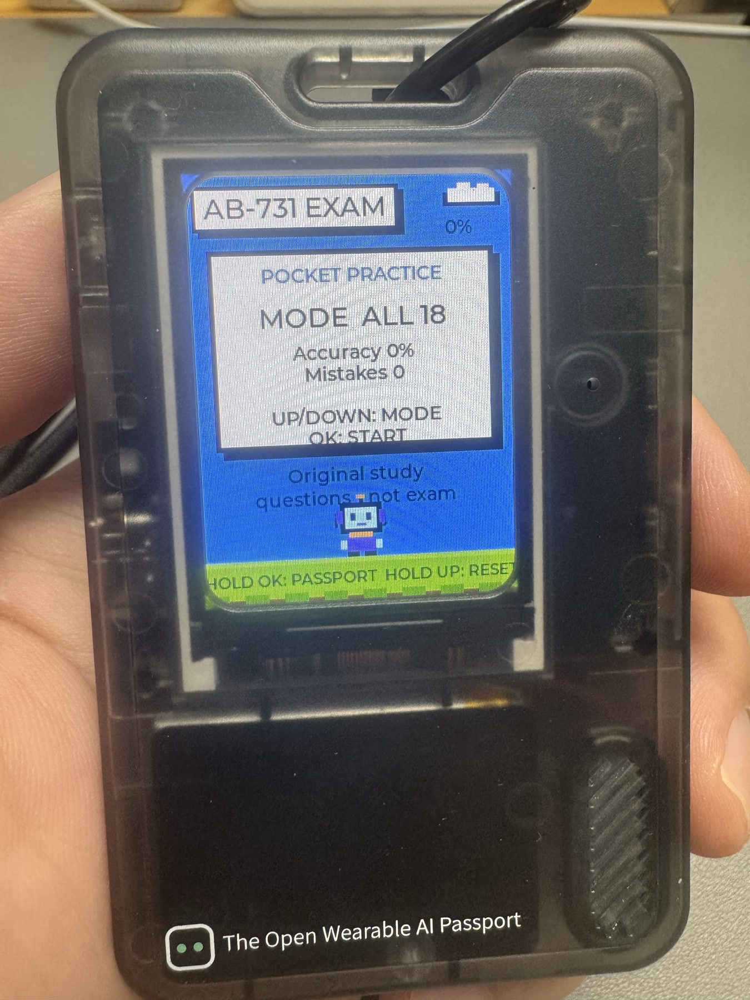
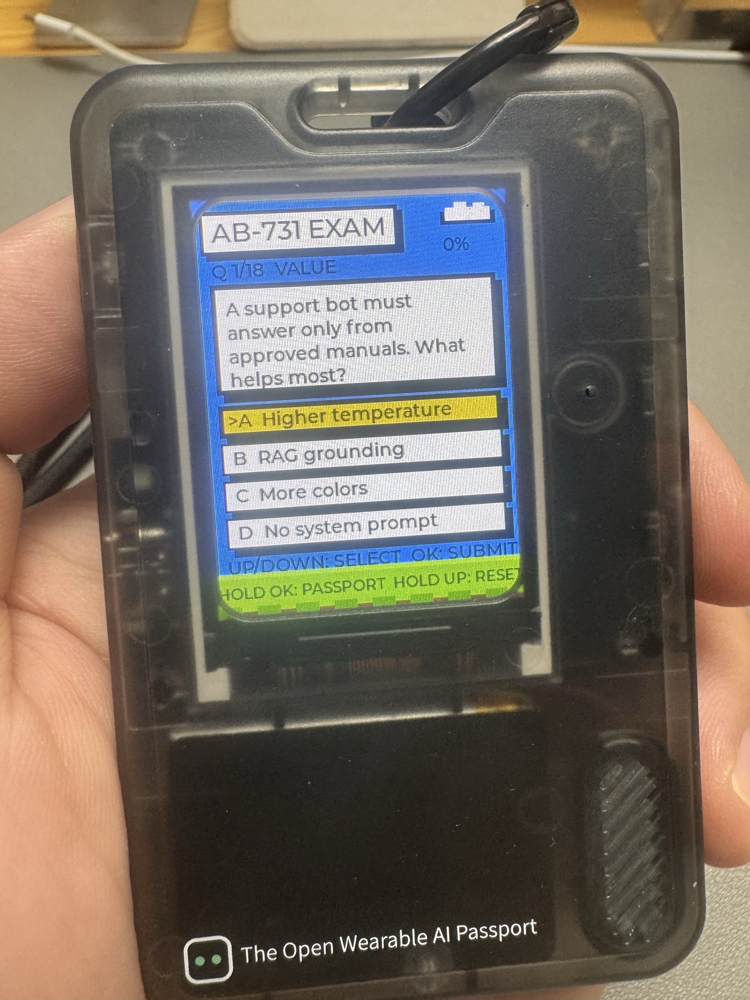

<p align="right">
  <strong>简体中文</strong> · <a href="README.md">English</a>
</p>

# AI Passport 2026

<p align="center">
  
</p>

这是我的第三个开源项目：为 FoloToy AI Passport 制作的个人主页与可扩展应用入口。
开机先显示完整头像、创作者身份、日期、时间和电量，下面可以选择进入自己开发的
应用。

首个内置应用是离线 AB-731 随身练习。它包含 100 道对齐 Microsoft Learn
2026 年 7 月 22 日版技能范围的原创练习题，用于学习，不是真实考试题。

## 项目亮点

- 个人 Passport 首页显示完整 3:4 头像和身份介绍。
- 首页同时显示本地日期、时间与电量。
- AB-731 作为可选择的子应用，不会取代开机个人主页。
- 四个答案始终同时可见，上/下键只移动一个高亮选项。
- 支持即时解析、错题重练、正确率统计和本地进度保存。
- 完全离线、三键操作，无需登录账号。

## 真机展示

<table>
  <tr>
    <td width="50%" align="center">
      <br>
      <sub>个人 Passport 首页与 AB-731 应用入口</sub>
    </td>
    <td width="50%" align="center">
      <br>
      <sub>实际运行中的完整穿戴设备</sub>
    </td>
  </tr>
  <tr>
    <td width="50%" align="center">
      <br>
      <sub>早期 18 题版本——作为真实迭代记录保留</sub>
    </td>
    <td width="50%" align="center">
      <br>
      <sub>早期四选一界面——不能作为当前 100 题版本的真机证明</sub>
    </td>
  </tr>
</table>

下方两张照片中清楚显示的是早期 18 题版本。当前仓库已经包含 100 道原创练习题，
但在补拍真实显示 `MODE ALL 100` 的设备画面前，不把 100 题固件描述为已完成真机验证。

## 按键

- Passport 首页：开机显示单个个人头像与应用菜单；AB-731 默认高亮，按一次
  确认键即可打开。
- AB-731 首页：按上/下键切换“全部题目”和“错题重练”，按确认键开始。
- 答题：四个答案会同时显示；按上/下键移动高亮框，按确认键提交。
- 解析：按确认键进入下一题。
- AB-731 内任意页面：长按确认键返回 Passport 个人首页。
- AB-731 内任意页面：长按上键清空答题记录并回到应用首页。

累计正确率、错题和最近题目保存在设备 NVS 中。Flash 写入由后台任务完成，
避免阻塞按键响应。

离线时钟从固件构建时间开始运行，设备运行期间持续计时；当前版本不联网自动校时。

## 构建

激活 ESP-IDF v5.5.3 后运行：

```bash
./tools/validate.sh
```

校验通过的可安装固件会输出到 `build/FoloToy-AI-Passport-full.bin`。刷写固件以及屏幕、
按键的真机验收仍需连接 AI Passport 设备。

## 安装

可以从 GitHub 最新 Release 下载 `FoloToy-AI-Passport-full.bin`，也可以使用上面的
命令自行构建。已写入身份信息的 Passport 必须保留受保护的设备身份分区；使用底层
刷写工具前请先阅读仓库中的 Flash 保护布局说明。

## 开源来源

本项目基于 [FoloToy AI Passport](https://github.com/folotoy/ai-passport) 开发，
保留其 MIT 许可证与上游提交历史。个人主页、头像展示、应用入口、AB-731 学习体验、
原创题库、进度流程及相关测试由 Lei Pan（`paul010`）维护。
